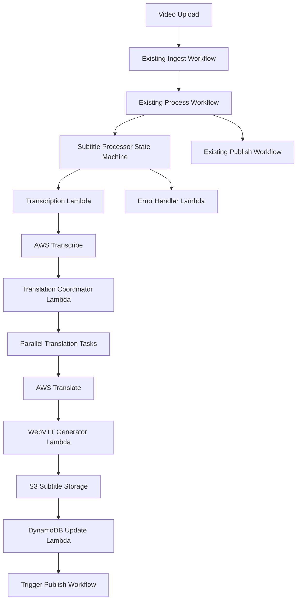

# Design Document: Video Transcription and Translation State Machine

## Overview

This design document outlines the implementation of a new state machine for the Video on Demand on AWS solution that will handle transcription and translation of video content. The new **Subtitle Processor** state machine will integrate seamlessly with the existing workflow, processing video files to generate WebVTT subtitle files in multiple languages without disrupting the current transcoding process.

The solution leverages AWS Transcribe for speech-to-text conversion and AWS Translate for multi-language translation, orchestrated through AWS Step Functions. The subtitle files will be stored alongside the transcoded video content and delivered through the existing CloudFront distribution.

## Architecture

### High-Level Architecture



### Integration Points

The new state machine integrates with the existing Video on Demand workflow at these key points:

1. **Trigger Point**: The Subtitle Processor is triggered after the existing Process Workflow completes MediaConvert job submission
2. **Data Flow**: Uses the same DynamoDB table and S3 buckets as the existing workflow
3. **Error Handling**: Leverages the existing error handler Lambda function
4. **Notifications**: Uses the same SNS/SQS notification mechanisms
5. **Completion**: Triggers the existing Publish Workflow when subtitle processing completes

## Components and Interfaces

### New Lambda Functions

#### 1. Transcription Lambda (`source/transcription/`)
- **Purpose**: Initiates and monitors AWS Transcribe jobs for video files
- **Input**: Video metadata from DynamoDB (S3 location, job ID, configuration)
- **Output**: Transcription job status and results location
- **Key Functions**:
  - Start transcription job with WebVTT output format
  - Poll job status with exponential backoff
  - Handle language detection or use configured primary language
  - Store transcription results in S3

#### 2. Translation Coordinator Lambda (`source/translation-coordinator/`)
- **Purpose**: Orchestrates parallel translation tasks for multiple target languages
- **Input**: Transcription results and target language configuration
- **Output**: Array of translation task configurations for parallel execution
- **Key Functions**:
  - Parse transcription JSON to extract text segments with timestamps
  - Generate translation tasks for each configured target language
  - Prepare input data for parallel translation execution

#### 3. Translation Worker Lambda (`source/translation-worker/`)
- **Purpose**: Translates text segments for a specific target language
- **Input**: Text segments with timestamps and target language code
- **Output**: Translated text segments with preserved timestamps
- **Key Functions**:
  - Translate text using AWS Translate API
  - Preserve timing information during translation
  - Handle translation errors gracefully
  - Return structured translation results

#### 4. WebVTT Generator Lambda (`source/webvtt-generator/`)
- **Purpose**: Generates properly formatted WebVTT files from translated content
- **Input**: Translated text segments with timestamps for all languages
- **Output**: WebVTT files stored in S3 with metadata updates
- **Key Functions**:
  - Generate WebVTT format with proper headers and timing
  - Create separate files for each language
  - Validate WebVTT syntax
  - Store files in S3 with consistent naming convention
  - Update DynamoDB with subtitle file locations

### Modified Components

#### DynamoDB Schema Extensions
The existing DynamoDB table will be extended with new fields:

```json
{
  "subtitleProcessing": {
    "enabled": "boolean",
    "status": "string", // "pending", "transcribing", "translating", "generating", "completed", "failed"
    "primaryLanguage": "string", // "auto" or specific language code
    "targetLanguages": ["string"], // array of target language codes
    "transcriptionJobId": "string",
    "transcriptionStatus": "string",
    "subtitleFiles": {
      "en": "s3://bucket/path/video.en.vtt",
      "es": "s3://bucket/path/video.es.vtt"
      // ... other languages
    },
    "errorDetails": "string",
    "processingStartTime": "timestamp",
    "processingEndTime": "timestamp"
  }
}
```

#### CloudFormation Template Updates
New resources to be added to the existing template:

- Subtitle Processor State Machine
- Four new Lambda functions with appropriate IAM roles
- IAM policies for Transcribe and Translate service access
- Environment variables for subtitle processing configuration
- CloudWatch Log Groups for new Lambda functions

## Data Models

### Transcription Job Configuration
```typescript
interface TranscriptionConfig {
  jobName: string;
  mediaUri: string;
  outputBucket: string;
  outputKey: string;
  languageCode: string; // "auto" for detection or specific code
  subtitleFormats: ["vtt"];
  outputStartIndex: 1;
}
```

### Translation Task
```typescript
interface TranslationTask {
  sourceLanguage: string;
  targetLanguage: string;
  textSegments: TextSegment[];
  jobId: string;
}

interface TextSegment {
  startTime: number; // milliseconds
  endTime: number;   // milliseconds
  text: string;
}
```

### WebVTT Output
```typescript
interface WebVTTFile {
  language: string;
  filename: string;
  s3Location: string;
  content: string; // WebVTT formatted content
  size: number;
  checksum: string;
}
```

### State Machine Input/Output
```typescript
interface SubtitleProcessorInput {
  guid: string;
  jobId: string;
  srcVideo: string;
  srcBucket: string;
  destBucket: string;
  subtitleConfig: {
    enabled: boolean;
    primaryLanguage: string;
    targetLanguages: string[];
  };
}

interface SubtitleProcessorOutput {
  guid: string;
  jobId: string;
  subtitleProcessing: {
    status: string;
    subtitleFiles: Record<string, string>;
    errorDetails?: string;
  };
}
```

## Correctness Properties

*A property is a characteristic or behavior that should hold true across all valid executions of a system—essentially, a formal statement about what the system should do. Properties serve as the bridge between human-readable specifications and machine-verifiable correctness guarantees.*

### Property-Based Testing Properties

Based on the requirements analysis, the following correctness properties must hold for all valid executions:

**Property 1: Workflow Integration Trigger**
*For any* video processing job that completes the existing Process Workflow, the Subtitle Processor state machine should be triggered automatically
**Validates: Requirements 1.1, 5.1**

**Property 2: Transcription Round Trip with Timing**
*For any* video file with speech content, transcription should produce timed text segments where the timing information is preserved through the entire processing pipeline
**Validates: Requirements 1.2, 1.3, 2.2**

**Property 3: Video Format Support**
*For any* video file in supported formats (MP4, MOV, M4V, MPG, M2TS), the transcription service should successfully process the audio track
**Validates: Requirements 1.5**

**Property 4: Parallel Translation Processing**
*For any* transcription result with multiple configured target languages, translation tasks should execute concurrently rather than sequentially
**Validates: Requirements 2.1, 2.3, 8.1**

**Property 5: Language Support Coverage**
*For any* text content, translation should succeed for all specified supported languages (English, Spanish, French, German, Italian, Portuguese, Brazilian Portuguese, Japanese, Korean, Chinese, Arabic)
**Validates: Requirements 2.4**

**Property 6: WebVTT Format Correctness**
*For any* translated text segments with timing information, the generated WebVTT files should be syntactically valid, UTF-8 encoded, and contain all required elements (timing cues, text content, language metadata)
**Validates: Requirements 3.1, 3.2, 3.3, 3.4**

**Property 7: File Organization Consistency**
*For any* video file and its generated subtitle files, the subtitle files should be stored in the same directory structure with consistent naming patterns (video_name.lang.vtt)
**Validates: Requirements 3.5, 4.1, 4.2, 4.3**

**Property 8: Database State Consistency**
*For any* subtitle processing operation, the DynamoDB record should accurately reflect the current processing status, file locations, and any error details
**Validates: Requirements 4.4, 7.4**

**Property 9: CDN Accessibility**
*For any* generated subtitle file, it should be accessible through the existing CloudFront distribution using the expected URL pattern
**Validates: Requirements 4.5**

**Property 10: Workflow Independence**
*For any* video processing job, the Subtitle Processor should run without blocking the existing Publish Workflow, and both can complete independently
**Validates: Requirements 5.2, 5.3**

**Property 11: Error Isolation**
*For any* processing failure in subtitle generation (transcription, translation, or WebVTT generation), the main video workflow should continue uninterrupted
**Validates: Requirements 1.4, 2.5, 7.5**

**Property 12: Configuration Respect**
*For any* subtitle processing configuration (enabled/disabled, target languages, primary language), the processor should respect these settings and process only what is configured
**Validates: Requirements 6.1, 6.2, 6.3, 6.4, 6.5**

**Property 13: Error Handling and Notification**
*For any* processing error, appropriate error information should be logged and notifications should be sent through the existing error handling mechanisms
**Validates: Requirements 7.1, 7.3**

**Property 14: Retry Behavior**
*For any* transient failure, the system should implement retry logic with exponential backoff before marking the operation as failed
**Validates: Requirements 7.2**

**Property 15: Video Length Support**
*For any* video file up to 4 hours in length, the transcription and translation process should complete successfully within appropriate timeout limits
**Validates: Requirements 8.2, 8.4**

## Error Handling

The Subtitle Processor implements comprehensive error handling that aligns with the existing Video on Demand solution patterns:

### Error Categories

1. **Transient Errors**: Network timeouts, service throttling, temporary service unavailability
   - **Handling**: Exponential backoff retry (3 attempts with 2x backoff)
   - **Recovery**: Continue processing after successful retry

2. **Configuration Errors**: Invalid language codes, missing permissions, malformed input
   - **Handling**: Immediate failure with detailed logging
   - **Recovery**: Skip subtitle processing, continue main workflow

3. **Service Errors**: Transcribe job failures, Translate API errors, S3 access issues
   - **Handling**: Log error details, update DynamoDB status
   - **Recovery**: Continue main workflow without subtitles

4. **Timeout Errors**: Long-running transcription jobs, Lambda function timeouts
   - **Handling**: Graceful timeout with status updates
   - **Recovery**: Mark as failed, continue workflow

### Error Propagation

- **Non-Critical Errors**: Subtitle processing failures do not block the main video workflow
- **Critical Errors**: Only configuration or permission errors that prevent workflow continuation
- **Error Notifications**: Leverage existing SNS/SQS notification infrastructure
- **Error Logging**: Detailed CloudWatch logs with correlation IDs for troubleshooting

### State Machine Error Handling

```json
{
  "Retry": [
    {
      "ErrorEquals": ["Lambda.ServiceException", "Lambda.AWSLambdaException"],
      "IntervalSeconds": 2,
      "MaxAttempts": 3,
      "BackoffRate": 2.0
    }
  ],
  "Catch": [
    {
      "ErrorEquals": ["States.ALL"],
      "Next": "ErrorHandler",
      "ResultPath": "$.error"
    }
  ]
}
```

## Testing Strategy

The testing strategy follows a dual approach combining unit tests for specific scenarios and property-based tests for comprehensive coverage:

### Unit Testing Approach

**Specific Examples and Edge Cases:**
- Test transcription with videos containing no speech (should skip gracefully)
- Test translation with unsupported language pairs (should fail gracefully)
- Test WebVTT generation with special characters and long text segments
- Test S3 storage with various file naming scenarios
- Test DynamoDB updates with concurrent access patterns
- Test CloudFront URL generation with different video file structures

**Integration Testing:**
- Test end-to-end workflow with sample video files
- Test integration with existing state machines
- Test error propagation through the workflow
- Test notification delivery through SNS/SQS

**Error Condition Testing:**
- Test behavior when AWS Transcribe service is unavailable
- Test behavior when AWS Translate service is throttled
- Test behavior when S3 storage fails
- Test behavior when DynamoDB updates fail

### Property-Based Testing Configuration

**Framework**: Use AWS SDK testing utilities with property-based testing library (fast-check for Node.js)

**Test Configuration:**
- **Minimum iterations**: 100 per property test
- **Timeout settings**: 30 seconds for transcription tests, 10 seconds for others
- **Data generation**: Smart generators for video metadata, language codes, and text segments

**Property Test Tags:**
Each property test must include a comment referencing its design document property:
```javascript
// Feature: video-transcription-translation, Property 1: Workflow Integration Trigger
// Feature: video-transcription-translation, Property 2: Transcription Round Trip with Timing
```

**Test Data Generators:**
- **Video metadata generator**: Creates realistic video file metadata with various formats and lengths
- **Language code generator**: Generates valid language codes from supported set
- **Text segment generator**: Creates timed text segments with realistic timing patterns
- **Configuration generator**: Creates valid subtitle processing configurations

### Testing Infrastructure

**Test Environment:**
- Use localstack for local AWS service simulation during development
- Use dedicated test AWS account for integration testing
- Mock external dependencies for unit tests
- Use real AWS services for property-based integration tests

**Test Data Management:**
- Sample video files in various formats for testing
- Reference transcription outputs for validation
- Test subtitle files in multiple languages
- Configuration templates for different scenarios

**Continuous Testing:**
- Run unit tests on every code change
- Run property tests on pull requests
- Run integration tests on deployment to staging
- Run performance tests weekly with various video lengths

The testing strategy ensures that the subtitle processing functionality is thoroughly validated while maintaining the reliability and performance standards of the existing Video on Demand solution.